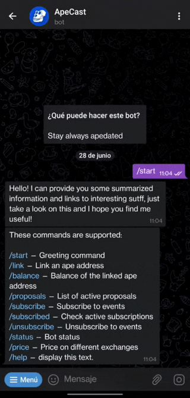

<div align="center">
    
    <h1><code>APECAST</code></h1>
</div>

[APECAST](https://t.me/ApeCastBot)

## What is this?
This is a telegram bot that helps you to keep updated about Apecoin. Nowadays there are so many data sources and handling them manually it is pretty impossible for an ape being. This bot summarizes
and gathers relevant information and at the same time it can answer some queries. Well, probably you already knew what a bot does.

<div align="center">
    
</div>


## Features
The objective of these features is to save time while being simple. If you miss something please tell me so I can implement it.

[Thankape](https://thankape.com/) contributions
----------------------
Via [thrivecoin](https://app.thrivecoin.com/) you can see some ways to contribute. Some of them are available only in a specific window
frame but this bot can notify you as soon as they are published so you will not miss them.

Active proposals
----------------
It is easy to access to `https://snapshot.org/#/apecoin.eth` but it is even easier to get it from telegram. You can ask (and share) for the active proposals. Since I just want this bot a as `notifier`, you will only get the title and the link. I don't not want to replace anything, the voting process and the full proposal description have to be done in `snapshot`.


Subscriptions
-------------
There are three kind of subscriptions:

* thankape: This event will notify when a new way to contribute is available.

* proposals: Get a notification when there is a new proposal at `https://snapshot.org/#/apecoin.eth` so you will not miss any

* price: It tells you when the `apecoin` prices suffers a prices change. Currently the threshold is fixed to +-4%.

* news: The bot crawls several crypto news pages looking for ape related articles. When something about `apecoin` is published, you will get it as soon as it finds it. More sources can be added and [here](src/monitor) you can see the current ones


Address Link
------------
First of all, this is a `soft` link. I mean, these actions does not require any kind of sign and everything handled here is public. The main
reason is about `scams&hacks`. Too many out there and even handling these things from telegram would be cool, it would be dangerous too. I don't want your apes and I don't that due a bug anyone else could.

So basically, you tell the bot what an address (can be yours or not) and you can check the current balance of this address.


Price
-----
Appart from the subscription, you can ask anytime the current price of `Apecoin`. The bot gathers information from several exchanges and send it to you summarized.


Forum Link Sharing
------------------
You can easily share links to forum posts. Just write `@apecastbot your query` on any chat and some search results will be shown. Click the desired one and you will share the link in this conversation


## Next steps
I just automated some tasks that save time to me. I the bot can help you in any way, you can tell me and I will include it. Appart from these requests, I'm focus on the `inlinequery` feature. Currently it is pretty simple and you can just list and filter the current proposals

<div align="center">
    
</div>

And I'm also working on free text. Yeah, something like a chatbot but about `apecoin`. But this is more for fun than a real need.

I will probably add more news sites to crawl and more integration with ApeCoin Dao (like https://forum.apecoin.com/)

I `do not` have in mind to include functionalities about sending/receiving apecoins. The reason is that once you do stuff like this, people has to trust you and you become an objective for cyberthieves. I want that the people using this bot is 100% secure and 0% risks. And this is the only way (by not implementing this stuff).


## Want to build it?

This bot is written in [Rust](https://www.rust-lang.org/). I like rust because it is secure, fast and fun. You can run it even in a raspberry pi very smoothly (you will not even notice about this process).

The easy way is using `cargo`:
```
cargo install apecast
```
Done!

But you want to build it manually form the repo the steps are also simple.
First clone the repo
```
git clone https://github.com/maxpowel/apecast
```

Then build it. I may take some time.

```
cargo build --release
```

Now run it!
```
./target/release/apecast --help
```

You only need this binary. No extra dependencies instal, libs or whatever. Just a file.
It is ready to be built for ARM (like raspberry pi) and many others. Check [cross](https://github.com/cross-rs/cross) for more information.


## Running it

To finally run it, create a telegram bot (tal to [@BotFather](https://t.me/BotFather) or read [this](https://core.telegram.org/bots/tutorial)) and run a mongodb database. With docker is as simple as

```
docker run --rm -p 27017:27017 --name mongo  mongo:latest
```
You can also get a free hosted database at [mongodb](https://www.mongodb.com/) (the free tier is more than enough).

You also need [meilisearch](https://github.com/meilisearch/meilisearch) for full text search. Installing and running it is as simple as:
```
curl -L https://install.meilisearch.com | sh
./meilisearch --master-key=masterKey
```

Finally, you can run it using env variables (nice when deploying to production severs)

```
MONGODB="mongodb://localhost/apecast" TELEGRAM_TOKEN=MyBotToken apecast
```
or with parameters
```
apecast --mongodb="mongodb://localhost/apecast" --telegram-token="MyBotToken"
```

If you want, you can provide an `etherscan` token. This is not required but without it, the
request rate will be very limited. It is used to know the `apecoin` address balance.

For more information run
```
./apecast --help
```


## How is it done

Several tools and libraries has been used. All of them are public and accesible by everyone.

* Language: 100% Rust
* Database: It uses mongodb
* Proposals: The [snapshot](https://snapshot.org) `graphql` api and [graphql-client](https://github.com/graphql-rust/graphql-client)
* Address balance: [etherscan](https://etherscan.io/) `api` and [reqwest](https://docs.rs/reqwest/latest/reqwest/) `http client`
* Price monitor: [crypto.com](https://exchange-docs.crypto.com/spot/index.html#websocket-root-endpoints ) `websocket api` and [rs-crypto-com-exchange](https://github.com/maxpowel/rs-crypto-com-exchange) library.
* Crawlers: Just [reqwest](https://docs.rs/reqwest/latest/reqwest/) as `http client` and [scraper](https://docs.rs/scraper/latest/scraper/) for web parsing
* Telegram: Obviusly telegram. And as a library [teloxide](https://github.com/teloxide/teloxide)
* Full text search: [meilisearch](https://github.com/meilisearch/meilisearch)


I think that this is all the relevant information. This tool is very useful for me and hopefully also for you. Remember that this tool is under development so if you find bugs or things missing please dont be mad at me. If you want to appreciate my effort, you can colaborate with ideas, feedback or pull requests. Also, you can drop some `apes` to: `0xFDc95386eb4641FAD468A24285A5cBBf086E1562`


Go apes go!